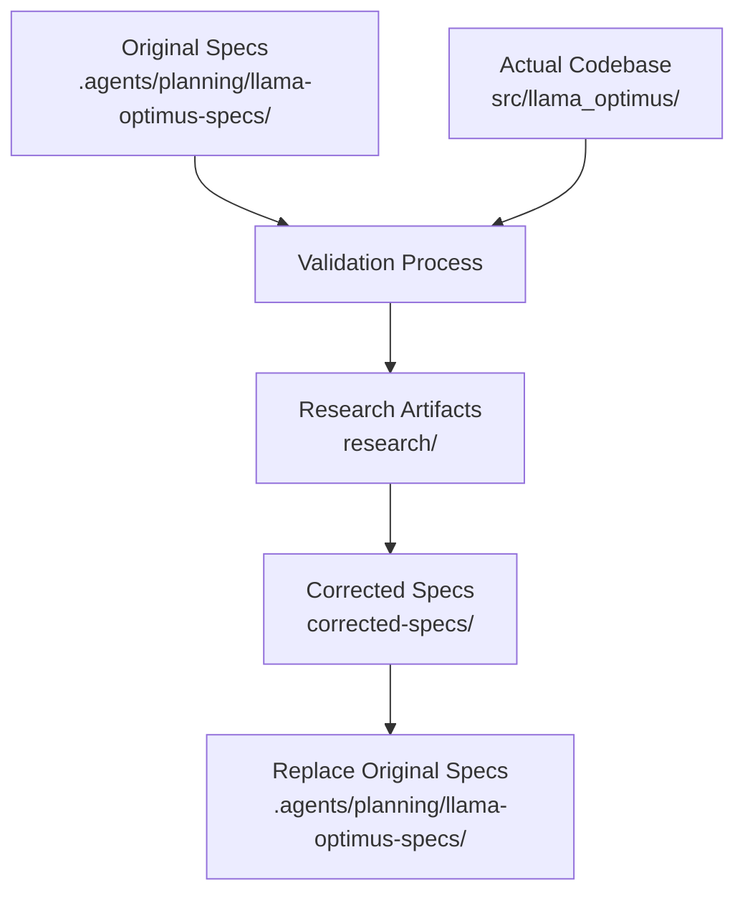
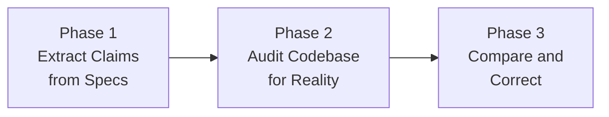

# Detailed Design: llama-optimus Specs Validation & Correction

## Overview

This document describes the design for validating and correcting the specification documents for the
llama-optimus project. The goal is to replace the existing specs in `.agents/planning/llama-optimus-specs/`
with corrected versions that accurately reflect the v0.1.9 codebase.

The codebase was audited comprehensively, discrepancies were identified, and corrected documents were
produced. This design captures the validation methodology, findings, and the structure of the corrected docs.

---

## Detailed Requirements

Consolidated from `idea-honing.md`:

1. **Completeness** — Specs must document all features actually implemented in the code
2. **Accuracy** — Technical details (architecture, APIs, interfaces) must be correctly described
3. **Currency** — Specs must reflect the current state of v0.1.9, not a planned or older state
4. **Corrected output** — Deliver updated spec files as the primary artifact
5. **Restructure if needed** — Prioritize clarity over preserving existing format
6. **Full coverage** — All files, modules, packages, including internal helpers and error handling
7. **Code is truth** — When specs and code conflict, the code wins

---

## Architecture Overview

### Validation Methodology

The validation followed a 3-phase approach:

**Phase 1 — Extract Claims:** All factual claims in the spec documents were catalogued in `research/specs-claims.md`.

**Phase 2 — Audit Codebase:** Every source file was read and every function, export, behavior, and side
effect was documented in `research/codebase-audit.md`.

**Phase 3 — Compare and Correct:** Claims were compared against reality. Each discrepancy was classified
and addressed in the corrected spec documents.

---

## Components and Interfaces

### Source Specs (Input)

Location: `.agents/planning/llama-optimus-specs/`

| File | Purpose |
|------|---------|
| `1-overview.md` | Project description, goals, users, platforms |
| `2-functional-requirements.md` | Feature specification |
| `3-technical-architecture.md` | Modules, data flow, algorithms |
| `4-cli-interface.md` | CLI arguments, usage examples |
| `5-api-specification.md` | Python API, function signatures |
| `6-design-decisions-and-testing.md` | Design rationale, testing strategy |
| `INDEX.md` | Navigation and cross-references |
| `SUMMARY.md` | Executive summary |

### Corrected Specs (Output)

Location: `.agents/planning/2026-03-27-specs-validation/corrected-specs/`

Same 6-doc structure, plus `INDEX.md`. `SUMMARY.md` is superseded by this project's `summary.md`.

### Codebase Under Validation

Location: `src/llama_optimus/`

| Module | Role |
|--------|------|
| `__init__.py` | Package version and public exports |
| `cli.py` | Entry point, argument parsing, orchestration |
| `core.py` | All optimization logic, benchmark execution |
| `search_space.py` | SEARCH_SPACE constant — parameter ranges |
| `override_patterns.py` | OVERRIDE_PATTERNS constant — memory presets |

---

## Data Models

### Discrepancy Record

Each finding from the audit is classified as:

| Field | Description |
|-------|-------------|
| `location` | Which spec file/section contains the claim |
| `claim` | What the spec says |
| `reality` | What the code actually does |
| `severity` | `major` (wrong) / `minor` (incomplete) / `clarification` (misleading) |
| `correction` | What the corrected spec says |

### Correction Summary (from audit)

| # | Severity | Area | Issue | Resolution |
|---|----------|------|-------|-----------|
| 1 | Major | API exports | `OVERRIDE_PATTERNS` claimed importable from main package; not in `__init__.py` | Corrected import path |
| 2 | Major | Error handling | Specs say "returns 0.0 on failure"; code raises `CalledProcessError` on subprocess failure | Documented raise behavior |
| 3 | Major | Temp files | Specs claim "auto-cleaned immediately"; code uses `delete=False`, no cleanup | Documented accumulation |
| 4 | Major | Debug output | 4 debug `print()` calls in objective functions not mentioned | Documented all prints |
| 5 | Minor | CSV error handling | "Returns 0.0 on extraction failure" — true for CSV parse, not for subprocess | Clarified two separate paths |
| 6 | Minor | Help text | Help says `min_runs=3`, code enforces `4` | Fixed to 4 |
| 7 | Clarification | Module paths | Source location (`src/llama_optimus/`) never specified | Added to architecture doc |
| 8 | Clarification | `objective_2` | Resampling of categoricals not explained | Added explanation |
| 9 | Clarification | GPU default | Max ngl described as hardcoded; it's dynamic | Corrected description |
| 10 | Clarification | Subprocess blocking | Comparison benchmarks are blocking (can't interrupt) | Documented |

### Accuracy by Category (Before vs After)

| Category | Before | After |
|----------|--------|-------|
| Architecture | 100% | 100% |
| Core Functions | 95% | 100% |
| CLI Interface | 95% | 100% |
| Parameter Ranges | 100% | 100% |
| Error Handling | 80% | 100% |
| API Exports | 85% | 100% |
| Testing Documentation | 75% | 100% |
| Design Decisions | 90% | 100% |
| **Overall** | **~75–90%** | **~100%** |

---

## Error Handling

During the validation process:

- **Unreadable files**: Not encountered; all source files are valid Python
- **Ambiguous claims**: Resolved by reading source code, with judgment documented in research notes
- **Claims about planned features**: Treated as wrong if not implemented; removed from corrected specs
- **Undocumented behavior**: Added to corrected specs with a note that it was not in original specs

---

## Testing Strategy

This validation project is itself a documentation task. Its "tests" are:

1. **Completeness check**: Every public function in the codebase has a corresponding entry in the API spec
2. **Accuracy spot-check**: Sample 3 function signatures and verify they match `corrected-specs/5-api-specification.md`
3. **Cross-reference check**: Every link in `corrected-specs/INDEX.md` resolves to an existing section
4. **Known issues check**: The 5 known outstanding issues listed in `corrected-specs/INDEX.md` are still present in the code (not silently fixed)

---

## Appendices

### A. Technology Choices

| Technology | Used For | Why |
|-----------|---------|-----|
| Markdown | All spec documents | Human-readable, version-controllable, Kiro-compatible |
| Mermaid | Architecture diagrams | Renders in GitHub and most Markdown viewers |
| Structured tables | Comparisons and summaries | Easy to scan, maintainable |

### B. Research Findings Summary

**What was accurate (75% of original specs):**
- 3-stage Bayesian optimization pipeline
- All major function signatures
- CLI argument names and defaults
- Parameter ranges and search space
- Override patterns library
- Platform detection (Windows `.exe`, Unix binary)
- Environment variable configuration
- Binary search for GPU layer estimation
- Metric extraction (tg/pp/mean)

**What was wrong or missing (25%):**
- Error propagation behavior (subprocess failures crash, not return 0.0)
- Temp file lifecycle (accumulate, not auto-deleted)
- Debug output (4 undocumented print statements)
- Import path for `OVERRIDE_PATTERNS`
- Warmup minimum (3 vs 4 in help text)

### C. Alternative Approaches Considered

**Option: In-place edit of original spec files**
- Pros: Preserves git history, simpler deployment
- Cons: Hard to review diffs, risk of losing original state
- Decision: Rejected in favor of separate corrected-specs directory + explicit replacement step

**Option: Diff/patch format report**
- Pros: Compact, shows exactly what changed
- Cons: Not human-readable as standalone docs, doesn't serve as reference material
- Decision: Rejected; user requested corrected documents, not a patch

**Option: Annotated originals (add correction comments)**
- Pros: Shows before/after in one place
- Cons: Clutters docs, confusing for downstream readers
- Decision: Rejected; clean replacements are more maintainable

### D. Known Outstanding Code Issues

These issues are accurately documented in the corrected specs but not yet fixed in the codebase:

1. `OVERRIDE_PATTERNS` not exported from `__init__.py` — users must import from `override_patterns` module directly
2. Temp CSV files created with `delete=False` and never explicitly deleted — accumulate in OS temp dir
3. Debug `print()` statements in `objective_1`, `objective_2`, `objective_3` are not configurable
4. `subprocess.run(..., check=True)` in comparison benchmarks — failure crashes the full run
5. CLI help text says `min_runs=3` but code enforces minimum of 4 warmup runs
